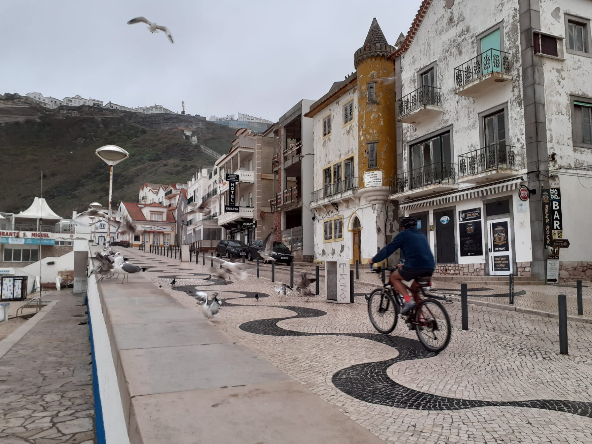

# xsel-to-image

This repo contains abnotation tool to pass image in and get text out into clipboard as
response to prompt givent to LLAVA - multimodal lamguage model.

Prompt:

'Describe image artistic style and scene settings'

LLAVA:

' The image depicts a street scene with a man on a bicycle, riding past
a waterfront. The atmosphere is artistic and charming, with a few
birds flying in the air, adding a sense of tranquility to the
scene. The man on the bicycle is near a building, giving a sense of
the urban setting.

In addition to the main cyclist, there are several birds scattered
throughout the scene, with some flying nearby and others perched on
various locations, giving a sense of life and movement. The presence
of these birds adds a sense of companionship to the overall scene.'

Who is LLaVA: Large Language and Vision Assistant

	https://github.com/haotian-liu/LLaVA

No automation, we can save screenshot into file and run LLAVA using llava-cli:

	: ./bin/llava-cli -m models/ggml-model-q5_k.gguf --mmproj models/mmproj-model-f16.gguf -p 'Describe image artistic style and scene settings' --image ./nazare.jpeg --verbose-prompt --top-p 160 --mirostat 2

Oneliner to put image selection from screen into clipboard using SCROT:

	: scrot -s - -e 'xclip -selection clipboard -target image/png -i $f'

Resorces to acomplish tasks above:

	- Inference of LLaMA model in pure C/C++ (examples/llava contains sources for bin/llava-cli)

	  https://github.com/ggerganov/llama.cpp/tree/master

	- GGUF files to inference llava-v1.5-7b with llama.cpp end-to-end without any extra dependency

	  https://huggingface.co/mys/ggml_llava-v1.5-7b/tree/main

Bugs:

	It's slow and no progress is visible.
	When key combination binded in WM, run in in separate xterm.

	: xterm -e /bin/bash -l -c xsel-to-image.sh

$ tree .
---
  .
  ├── -
  ├── bin
  │   ├── llava-cli
  │   └── xsel-to-image.sh
  ├── LICENSE
  ├── models
  │   ├── ggml-model-q5_k.gguf
  │   ├── mmproj-model-f16.gguf
  │   └── models.txt
  ├── nazare.jpeg
  └── README.md
---
